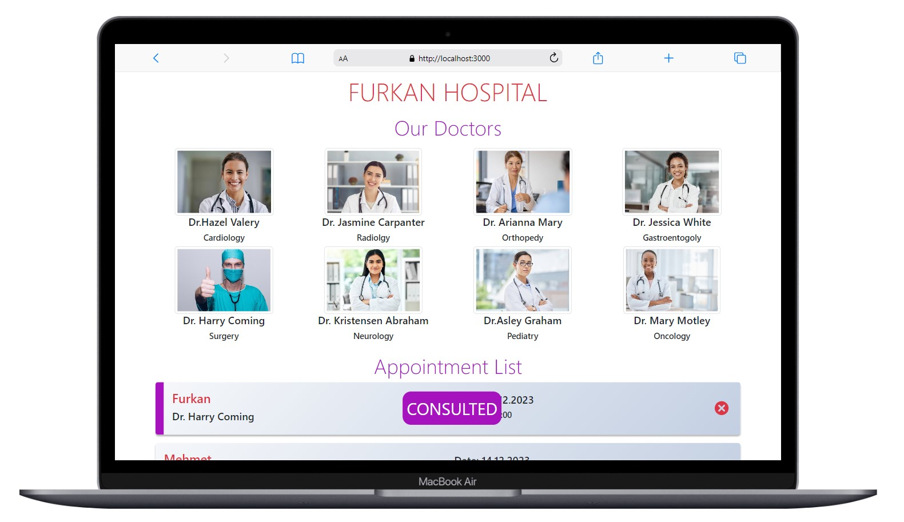

# Hospital Appointment

<div align="center">
  
</div>

## About the Project

This project is a Hospital Appointment Management System designed to facilitate the process of scheduling and managing appointments for patients.

## Live Demo

[Hospital Demo]()

## Features

- **Appointment Scheduling:** Patients can easily schedule appointments with healthcare providers.
- **Appointment Tracking:** View and manage scheduled appointments for both patients and hospital staff.
- **Availability Management:** Healthcare providers can set their availability for appointments.

## Project Skeleton

```
Hospital Appointment (folder)
|
|----readme.md         
SOLUTION
├── public
│     ├── img
│     └── index.html
├── src
│    ├── assets
│    │
│    ├── components
│    │       ├── AddModal.jsx
│    │       ├── AppointmentList.jsx
│    │       └── Doctors.jsx
│    │
│    ├── pages
│    │       └── Home.jsx
│    │
│    ├── helpers
│    │       └── Data.jsx
│    │
│    ├── App.js
│    ├── App.css
│    ├── index.js
│    └── index.css
├── package.json
└── yarn.lock
```

## Screenshots

<div align="center">
  
  
  
</div>

## Compatibility

The project is compatible with both wide-screen computers and mobile devices.